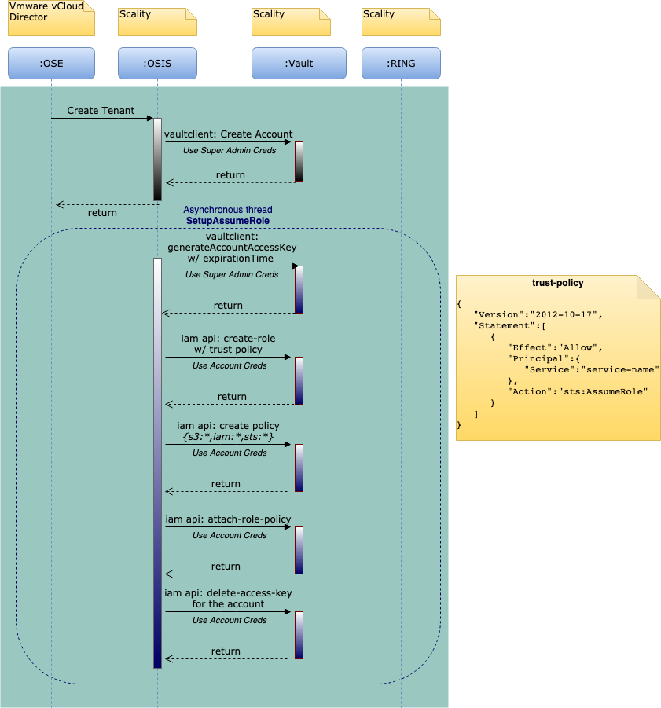
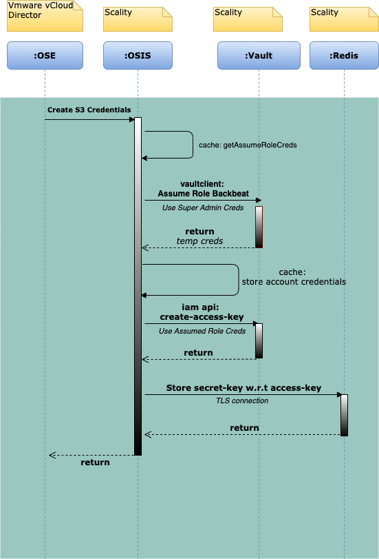
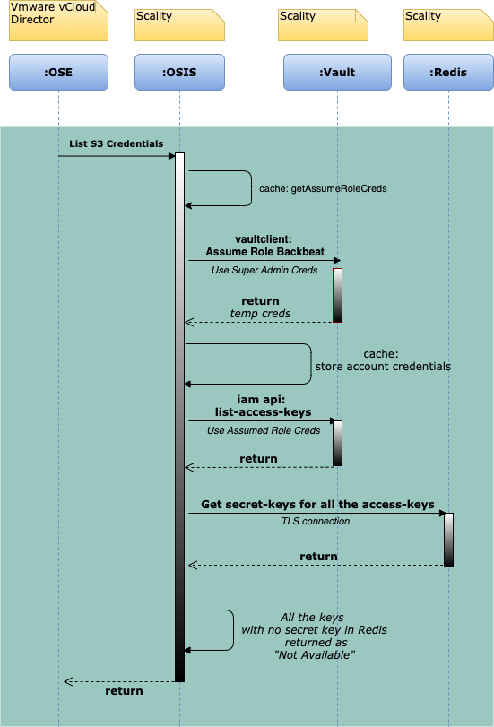
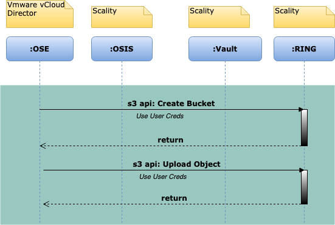

# Design for VCD OSE - OSIS
<details>
<summary><b>TABLE OF CONTENTS</b></summary>

* [OSIS inital setup](#osis-inital-setup)
   + [Activity Diagram for initial setup](#activity-diagram-for-initial-setup)
* [Tenant APIs](#tenant-apis)
   + [Create Tenant](#create-tenant)
   + [Create Tenant Example Activity Diagram](#create-tenant-example-activity-diagram)
   + [Query Tenants](#query-tenants)
   + [List Tenants](#list-tenants)
   + [Get Tenant](#get-tenant)
   + [Head Tenant](#head-tenant)
   + [Delete Tenant](#delete-tenant)
   + [Update Tenant](#update-tenant)
* [User APIs](#user-apis)
  + [Create User](#create-user)
  + [Create User Example Activity Diagram](#create-user-example-activity-diagram)
  + [Query Users](#query-users)
  + [List Users](#list-users)
  + [Get User w/ userid](#get-user-w--userid)
  + [Get User w/ canonical ID](#get-user-w--canonical-id)
  + [Head User](#head-user)
  + [Delete User](#delete-user)
  + [Update User](#update-user)
* [S3 Credential APIs](#s3-credential-apis)
  + [Create S3 Credential](#create-s3-credential)
  + [Query S3 Credentials](#query-s3-credentials)
  + [List S3 Credentials](#list-s3-credentials)
  + [Delete S3 Credential](#delete-s3-credential)
  + [Get S3 Credential](#get-s3-credential)
* [Miscellaneous APIs:](#miscellaneous-apis-)
  + [getProviderConsoleUrl](#getproviderconsoleurl)
  + [getTenantConsoleUrl](#gettenantconsoleurl)
  + [getS3Capabilities](#gets3capabilities)
  + [getInformation](#getinformation)
  + [updateOsisCaps (?)](#updateosiscaps----)
  + [getBucketList](#getbucketlist)
  + [getOsisUsage](#getosisusage)
* [S3 Operations Example Activity Diagram](#s3-operations-example-activity-diagram)
</details>

## OSIS inital setup

For the initial installation of OSIS application, following steps must be executed.
1. A **Super Admin** account will be created as part of S3C/Vault setup
1. Set OSE properties:
   1. S3 URL
   1. Admin Vault URL along with credentials as Super Admin access key/ secret key
    
_**Note: "Super Admin" account has full Account Management access and can use "AssumeRoleBackbeat" to assume a role of another Account.**_

## Tenant APIs
<u>**Important Assumptions:**</u>
* All the Tenant APIs on OSIS will use **Super Admin credentials** to manage on Vault.
* A Vault Account is equivalent of OSE Tenant.

### Create Tenant
This API creates a Tenant on Vault.  
1. Vault `create-account` api will be called using vaultclient. 
    * Tenant Name is stored as Account Name  
    * `cd_tenant_ids` list as part of the request to be stored as a property of the vault account.
    * Account ID to be sent back as storage tenant ID to OSE
1. [F00] will trigger an asynchronous thread to invoke the `SetupAssumeRole` subroutine. For more, see [SetupAssumeRole-subroutine](#SetupAssumeRole-subroutine).

### Create Tenant Example Activity Diagram


### List Tenants
This API will list tenants on Vault. 

* `List Tenants` API can be called with following parameters:
    * `offset`:  The start index of tenants to return (optional)
    * `limit`: Maximum number of tenants to return (optional)

* Vault `list-accounts` api will be called using vaultclient with parameters
   1. `marker` (if exists from `markerCache`)
   1. `max-limit`
   1.  `filterKeyStartsWith=cd_tenant_id` (Only return the accounts with at least one `cd_tenant_id`)

* <u>`markerCache`</u>
    * Every time `List Accounts` API is called by the OSIS, if `isTruncated` is `true` in the response, then `marker` value will be stored in the `markerCache` with the key as `(max-limit +1)`
    * Each entry in the `markerCache` will be short-lived (implementation is for no more than 60 seconds).
    * See [Cache-Design](#Cache-Design) for more information. 

### Query Tenants
This API will query tenants on Vault using a `filter` parameter.

1. `Query Tenants` API can be called with following parameters:
    * `offset`:  The start index of tenants to return (optional)
    * `limit`: Maximum number of tenants to return (optional)
    * `filter` parameter
        * Usually the OSE passes only the `cd_tenant_id` field with a value under `filter` parameter
        * If `cd_tenant_id` filter parameter is passed, `cd_tenant_id` value will be validated for UUID format.
        * If `cd_tenant_id` filter value is in UUID format, `list-accounts` api will be invoked.
        * If `cd_tenant_id` filter value is not in UUID format, `get-account` api will be invoked with the provided value.
    
1. Vault `list-accounts` api will be called using vaultclient with parameters
    1. `marker` (if exists from `markerCache`)
    1. `max-limit`
    1. `filterKey=cd_tenant_id%3D%3D<uuid1>` (The `filter` value from OSE will always be in the `cd_tenant_id%3D%3D<uuid1>` format).
        * Cache design can be found [here](#Cache-Design).
    

### Get Tenant
This API will return the tenant on Vault with `tenantID`.
1. Vault `get-account` api will be called using vaultclient with the provided `tenantID` as `AccountID`.

### Head Tenant
This API will check whether the tenant exists on Vault with `tenantID`.
1. Vault `get-account` api will be called using vaultclient with the provided `tenantID` as `AccountID`.
1. Return `true` or `false` if result is returned or not respectively.

### Delete Tenant
This API will delete the tenant on Vault. 

1. Vault `delete-account` api will be called using vaultclient with the provided `tenantID` as `AccountID`.
1. Return error if account is not empty.

### Update Tenant
This API will update the existing storage tenant with the provided `cd_tenant_id`. Input parameters are:
* `tenantId`:   Tenant ID of the tenant to update
* `tenant` object: Object that holds the new `cd_tenant_ids` along with original `tenant` properties.

1. Vault `update-account` api will be called using vaultclient with the provided `tenantID` as `AccountID` and `tenant` properties

### `SetupAssumeRole` subroutine
1. Use vaultclient to call `generate-account-access-key` with `durationSeconds` for the account.
1. Create a role using the generated access key with:
    1. Role name: `osis` (So role-arn can be generated in the format `arn:aws:iam::[account-id]:role/osis`)
    1. Trust policy:
   ```json
    {
        "Version": "2012-10-17",
        "Statement": [{
            "Effect": "Allow",
            "Principal": {
                "Service": "service-name"
            },
            "Action": "sts:AssumeRole"
            }]
    }
   ```
    * **Note:** 
        *  This role is visible to and modifiable by the root account user or by
           an IAM user with correct permissions (iam:list-roles,
           iam:deleteRoles...). _Do not edit this role._ If this role has been 
           edited, delete it. It will be automatically repopulated (See
           [Assume-Role](#Assume-Role) for more).
        
1. Create an IAM managed policy `adminPolicy@[account-id]` with full S3 and IAM access using the generated access key.
1. Invoke `attach-role-policy` to attach the policy `adminPolicy@[account-id]` to the `osis` role using the generated access key.
1. Use `delete-access-key` to delete the account's access key.

## User APIs

### Common Behavior for All User APIs
* Invoke the [Assume Role flow](#Assume-Role) before accessing any user APIs. 
* If any user API returns an `Access Denied` error with the message: 
  `user [RoleArn] don't have any policies, denied access`,  then invoke the 
  `SetupAssumeRolePolicy` flow (See [Setup-Assume-Role-Policy](#Set-up-assume-role-policy).

### Set Up Assume Role Policy
1. Generate an access key for the account by using vaultclient to call `generate-account-access-key` with `durationSeconds`.
1. Invoke IAM `get-policy` API for policy `adminPolicy@[account-id]` using the generated access key.
1. If no policy is returned, use the generated access key to create an IAM managed policy `adminPolicy@[account-id]` with full s3 and iam access (`{ s3:*, iam:* }`).
1. Invoke `attach-role-policy` to attach the policy `adminPolicy@[account-id]` to the `osis` role using the generated access key.
1. `delete-access-key` for the account.

### Assume Role
* Before invoking a User API, you must call the `AssumeRole` flow. Use the tenant account credentials from `assumeRoleCache` for the given account ID before each User API.
* If the tenant account credentials were not found in `assumeRoleCache`, the `AssumeRoleBackbeat` API must be called as superadmin and added to the `assumeRoleCache` cache.
* If the `AssumeRoleBackbeat` API returns a `NoSuchEntity` error with a `Role does not exist` description, use vaultclient to invoke `get-account` with `accountID` to retrieve the `accountName` and then invoke the [`SetupAssumeRole` subroutine](#SetupAssumeRole-subroutine)).
* `assumeRoleCache` cache will be a **[key, value]** pair of **[Role_Arn, Temporary_Credentials]** respectively.
    * Each `assumeRoleCache` entry will have a 50-minute TTL (its session token is valid only for 60 minutes).
    * When accessing credentials on the cache, refresh the credentials as well as `needsRefresh` (using AWS SDK `refresh()`), as they are subject to expiration.
    * Cache design can be found [here](#Cache-Design).
    
### Create User
This API creates a user on Vault.
1. `create-user` api will be called using assumed role credentials.
    * The tenant user's `cdUserId` is stored as `username` in the corresponding Vault user.
    * The tenant user's `username`, `role` enum value, `emailAddress`, `cdTenantID` and account's `canonicalID` are stored in the Vault user path as `/<tenantUsername>/<roleEnumValue>/<email>/<cdTenantID>/<canonicalID>/`.
1. The `get-policy` API will be called with the `userPolicy@[account-id]` policy name using assumed role credentials
1. If the `get-policy` API does not return any policy, using the assumed role credentials creates an IAM managed policy with the `userPolicy@[account-id]` policy name with full S3 access.
1. `attach-policy` for the new user will be called using the assumed role credentials and the policy arn formatted as `arn:aws:iam::[account-id]:policy/userPolicy@[account-id]`.
1. The IAM `generate-access-key` API will be called using assumed role credentials.
1. Encrypt the secret key (For more, see [SecretKey-Encryption-Strategy](#SecretKey-Encryption-Strategy)). Store the encrypted secret key on Redis Sentinel in the hash named "osis:s3credentials", with the hash key formatted as `<Username>__<AccessKeyID>`.

### Create User Example Activity Diagram


### List Users
This API will list users on Vault.
1. The `list-users` API can be called with following parameters:
    * `offset`: The start index of tenants to return (optional)
    * `limit`: The maximum number of tenants to return (optional)
1. `list-users` api will be called using assumed role credentials.
    * If `offset` is present, return the `list-users` result by providing the `offset` value as the `marker` parameter.

### Query Users
This API will query users on Vault using a `filter` parameter with the filters of `cd_tenant_id` and `display_name`.
1. Extract the `cd_tenant_id` filter from the `filter` parameter.
    1. If `cd_tenant_id` filter value is in the UUID format, it will be used to call `list-accounts` using vaultclient to retrieve the `accountID`.
    1. If `cd_tenant_id` filter value is not in the UUID format, it will be considered as `accountID`.
1. Use `accountID` to generate assumed role credentials for that particular account.
1. Extract the `displayname` value from the `filter` parameter.
1. The `list-users` API will be called using assumed role credentials with the `path-prefix` as `/<display_name>/`.

### Get User with User ID
This API will return the user.
1. The `get-user` API will be called using assumed role credentials, with the tenant user's user ID as the username.

### Get User with Canonical ID
This API will return the user.
1. The `get-account` API will be called using vaultclient with the provided `canonical-id` and account details will be used to fill tenant details of the response.
1. The `list-users` API will be called with `offset` as 0 and `limit` as 1000 and the last user values in the response will be used to fill the user details of the response.
    * _`canonical-id` in Scality is defined with respect to an account and any specific user cannot be retrieved using only the `canonicalID`_
    * `get-user-with-canonical-id` API will be called by OSE only when user APIs does not return the `canonical-id` for any user.  

### Head User
This API will return if user exists or not.
1. The `get-user` API will be called using assumed-role credentials, with the tenant user's user ID as the username.
1. Return `true` or `false` if result is returned or not respectively.

### Delete User
This API will delete user on Vault.
1. `delete-user` api will be called using assumed role credentials.

### Update User
This API will enable or disable user on Vault.
1. `updateAccessKey` api will be called using assumed role credentials to disable/enable access keys for the user.

## S3 Credential APIs
### S3 Credential APIs Have Common Behavior with [User APIs](#Common-behavior-for-all-User-APIs)


### Create S3 Credential
This API creates S3 credentials for the user.
1. The Generate Access Key API will be called using assumed role credentials.
1. Encrypt the secret key (For more, see [SecretKey-Encryption-Strategy](#SecretKey-Encryption-Strategy)). Store the encrypted secret key on Redis Sentinel in the hash named `osis:s3credentials`, with the hash key formatted as `<Username>__<AccessKeyID>`.

**Important Notes:**
* Redis Sentinel is subject to an ongoing rolling upgrade.
* If the entire Redis Sentinel cluster fails or crashes, the vCloud Director's OSE service must be restarted with the following command:
    ```shell
    $ ose service restart
    ```
  * Once OSE service restart process is finished,
     * OSE will invoke `listS3Credentials` API to identify the keys for object storage operations. As no key is available for the user on Redis, OSIS will create a new key for object storage operations and returns along with all the other keys on Vault DB. (For more, see [List S3 Credentials](#List-S3-Credentials))
  * Access keys created by OSIS before Redis crash will be listed with `secretKey` value as `Not Available`. vCloud Director Tenant Users are responsible to clean up "Not Available" access keys using S3 console or IAM API because only they know if the access keys are in use or not.
* Redis Sentinel only supports storing **4294967295** (approx. 4.2 billion) keys in the hash.

### Create S3 Credential Example Activity Diagram


### Query S3 Credentials
This API query S3 credentials of the  user using a `filter` parameter.
1. `list-access-keys` api will be called using assumed role credentials.
1. Filter the result credentials using the `filter` parameter in the request.

### List S3 Credentials
This API list S3 credentials of the  user.
1. `list-access-keys` api will be called using assumed role credentials.
2. Retrieve the secret keys, formatted as `<Username>__<AccessKeyID>`, from Redis Sentinel.
3. Decrypt the secret keys (For more, see [SecretKey-Encryption-Strategy](#SecretKey-Encryption-Strategy)) and add them to the response.
4. If no key is available for the user on Redis, OSIS will invoke `createS3Credentials` API in the backend to create a new key for object storage operations and adds the new key to the response.
5. Add all the keys that are not present in the Redis Sentinel at the bottom of the list in the response with `secretKey` value as `Not Available`.

### List S3 Credentials Example Activity Diagram


### Delete S3 Credential
This API deletes the S3 credential of the user.
1. `delete-access-key` api will be called using assumed role credentials.

### Get S3 Credential
This API return S3 credential of the user.
1. `get-access-key` api will be called using assumed role credentials.

## Miscellaneous APIs:

### getProviderConsoleUrl
Get the console URI of the platform or platform tenant if tenantId is specified
* Return supervisor URL (Static and needs to be maintained in Config)
* This is a tunable

### getTenantConsoleUrl 
Get the console URI of the platform or platform tenant if tenantId is specified
1. First iteration
    1. It is configuration in application.yml
    1. It is Url of the S3 console

1. Optional: we can provide some kind of SSO)
1. For Next Gen production, it will be the XDM ui

### getS3Capabilities 
Get S3 capabilities of the platform
* It is using an xml file to show s3 capabilities it’s a copy paste from ceph code)

### getInformation
Get the information of the REST Services, including platform name, OSIS version and etc (Static Details)
1. First Version, Make all information configuration except the usage part
1. Next Gen, Implement the usage tenant level part with UTAPIv2 (write -java utapi-client)

### updateOsisCaps (?)

### getBucketList
Get the bucket list of the platform tenant
* S3:`listBucket` API
### getOsisUsage 
Get the platform usage of global (without query parameter), tenant (with tenant_id) or user (only with user_id).
1. We don’t know yet what needs to be done here
1. For next generation,
    1. Utapi Service level -> global platform
    1. Utapi Account level -> tenant level
    1. Utapi User level -> user level


## S3 Operations Example Activity Diagram


## Cache Design

1. Implement caches using the following principles:
    1. The cache must have a maximum capacity.
    1. The cache must have a Least Recently Used (LRU) eviction policy.
    1. Each cache entry must have an expiration time (TTL). 
        1. Cache `put` call must include `ttl` for the entry.
        1. Use `ScheduledFuture` in Java for cache entry removal after TTL.
    1. Caches must handle concurrency.
        1. Use `Read locks` for `get` calls and `write locks` for `put` calls.
    1. Caches can be configured using the following properties in `application.properties`:
       1. `ttl` for invalidating cache entries
       1. `maxCapacity` for maximum number of entries in the cache 
       1. A flag to enable or disable the cache

1. Implement the following caches for this project:
    1. `ListAccountsMarkerCache` for the `List Tenants` and `Query Tenants` APIs
        * `key` : `offset` and `value` : `marker`
    1. `AssumeRoleCache` for all the `User` and `S3 Credential` APIs
        * `key` : `RoleArn` and `value` : `Credentials`

## SecretKey Encryption Strategy

1. `secret-key` value in the form of plaintext will be encrypted and decrypted using the cipher algorithm (property: `cipher`), and corresponding cryptographic key (property: `secretKey`) of the latest key slot in the `osis.security.keys` list provided in the `crypto.yml` config file.
1. A `id` property will be provided for each key slot entry in the `osis.security.keys` list in the `crypto.yml` config file to maintain the version of the key and will be used in the Key rotation.
    1. Example `crypto.yml`
        ```yaml
        keys:
          - id: 2
            cipher: AES256GCM
            secretKey: YW5vdGhlcmxpbmVvZnBhc3N3b3JkZm9yYW5vdG==
          - id: 1
            cipher: AES256GCM
            secretKey: dGhpc2lzYXJlYWxseWxvbmdhbmRzdHJvbmdrZXk=
       ```
1. A java object of class `SecretKeyRepoData` will be created with variables `keyId`, `encryptedData` and `cipherInformation`
    * `keyId` variable will be of type String and stores the `id` property of the key used.
    * `encryptedData` will be a byte array and stores the encrypted data bytes.
    * `cipherInformation` will be an encapsulation to store all the additional information used by the cipher algorithm.
        * Example: For `AES256GCM` algorithm, `cipherInformation` encapsulates the `nonce` variable, which will be a byte array and stores the nonce bytes.
1. Java object of class `SecretKeyRepoData` will be serialized and stored as binary in Redis
1. During decryption, `keyId` in the meta information will be used to identify applied the cipher algorithm.
1. Initially, only the AES256GCM cipher algorithm is supported. (The Secretbox algorithm is suggested for future releases)
1. An ability to change the cipher algorithm will be provided.
1. **Key Rotation:**
    * Key rotation is used to replace a key with another one once the original key is compromised or too old to use.
    * `crypto.yml` file will be updated with a new key slot on top of `keys` list with an incremented `id` value.
    * A key rotation application jar file will be provided to do the key rotation of all the encrypted `secret-key` data on Redis database. 
        1. Key rotation application will use the meta-information of the encrypted data to identify the `keyId` used.
        1. Each `secret-key` will be decrypted using the old cipher algorithm (identified using the `keyId`).
        1. `secret-key` value will be re-encrypted using the latest cipher algorithm and updated on Redis.
        1. This key rotation application need to be re-run until it returns success which means all the `secret-key` values on Redis are re-encrypted. 
    * During decryption, if a new `keyId` is found, `OSIS` application will reload the `crypto.yml` file
