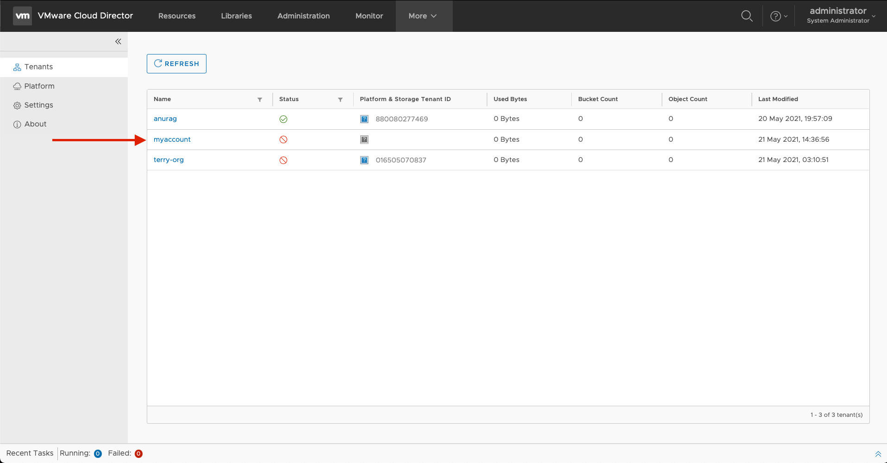
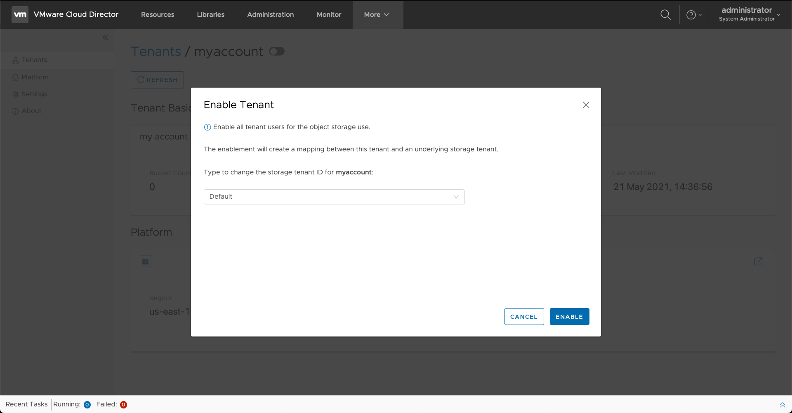
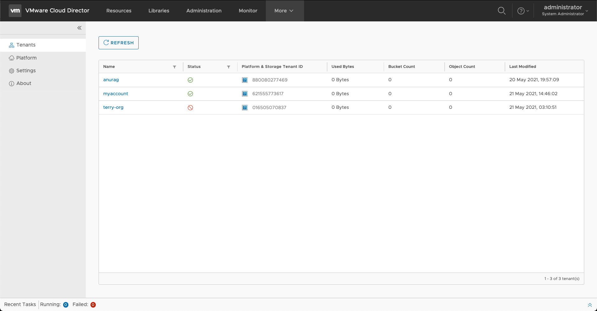
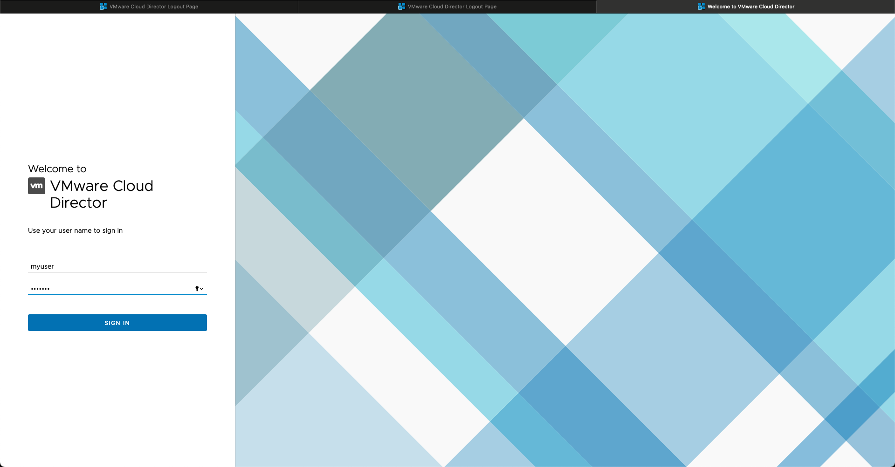
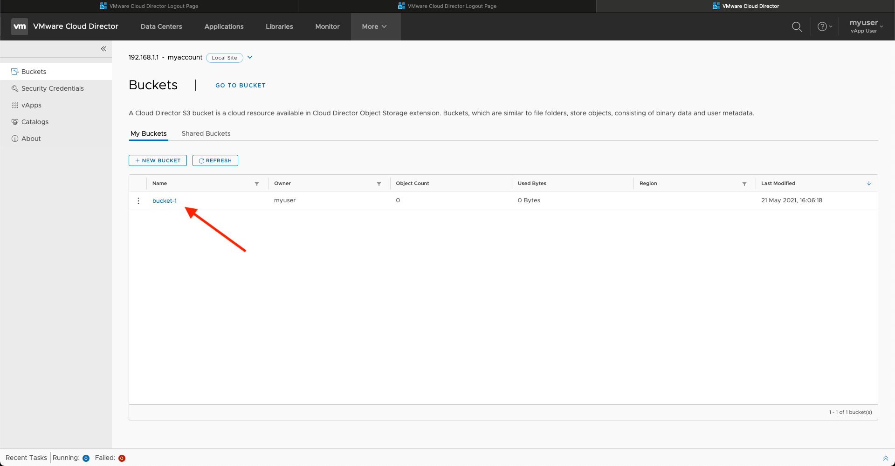

# Deployment Instructions

## Limitations

- Bucket versioning not supported: [S3C-4456](https://scality.atlassian.net/browse/S3C-4456)
- Buckets and objects not created via VMware OSE do not appear in vCloud Director: [S3C-4199](https://scality.atlassian.net/browse/S3C-4199)

## Prerequisites

### Prepare S3 Connector

#### Install RING v8.4 + S3Connector

- Documentation: <https://documentation.scality.com/RING/8.4.0/index.html>
- Package: <https://packages.scality.com/stable_ori_8403>

- [Alternate] Use install CI to install RING and S3 Connector: <https://scality.atlassian.net/wiki/spaces/OS/pages/1528496133/How-to+deploy+RING+S3Connector+on+scality.cloud+using+installci>

- Upgrade S3C using the latest package generated via [Federation CI](https://eve.devsca.com/github/scality/federation/) (v7.10 is not GA)
  Package used for dev testing: <https://eve.devsca.com/github/scality/federation/artifacts/builds/github:scality:federation:staging-7.10.0.0.r210614080650.b2c4b9c.pre-merge.00012275/s3-offline-centos7-7.10.0.0.tar.gz>
- Documentation: <https://documentation.scality.com/S3C/7.9.0/installation/upgrading_s3c/Upgrading_from_7.4.X_to_7.4.X.html>

Note: For credentials to download packages, please contact it@scality.com

### Prepare network

- Open ports `8600` and `8500` between stateful node and stateless node of S3 Connector (OSIS will be installed on the stateless node)
- Add stateless node IP in Vault config under s3 interface, to allow AssumeRoleBackbeat to be called over port: `8500`. By default, localhost is allowed. Hence if the stateful and stateless nodes are the same, no config change is needed.

```sh
# Get the location of the config for vault container on the storage node you want OSIS to communicate with
docker inspect scality-vault-1 | grep Source | grep conf
                "Source": "/scality/g1ssd1/s3/scality-vault-1/conf",

# In this case the config is located at /scality/g1ssd1/s3/scality-vault-1/conf/config.json
# Edit the config.json by adding the IP address of stateless node in the below array.
# Below we added `10.100.5.210`

.
.
.
 "interfaces": {
        "S3": {
            "address": "127.0.0.1",
            "port": 8500,
            "allowFrom": [
                "127.0.0.1",
                "::1",
                "10.100.5.203",
                "10.100.5.210"            ]
        },
.
.
.

# Save the config and restart vault container
docker restart scality-vault-1

# Now stateless node on which OSIS is deployed should be able to communicate with Vault over port 8500 for AssumeRoleBackbeat calls
```

## Run OSIS

### Prepare OSIS machine

- Use a stateless node of S3 Connector to run the OSIS docker container. If stateless and stateful nodes are on the same storage nodes in the lap, you can deploy it there.
- Pull this docker image. Use the latest commit from thew repository as SHA in the below command.

```sh
docker pull registry.scality.com/vmware-ose-scality-dev/vmware-ose-scality:<SHA>

```

- Generate a self-signed SSL certificate and store it in a binary PKCS#12 format file with extension .p12 file. Instructions [here](https://github.com/scality/vmware-ose-scality/blob/development/1.0/README.md#to-generate-a-pkcs12-file-for-a-self-signed-ssl-certificate)
- Create an crypto.yml environment variables file. A sample crypto.yml file can be found [here](https://github.com/scality/vmware-ose-scality/blob/development/1.0/src/main/resources/crypto.yml). Update osis.security.keys.cipher with a 32 byte password

- Create an application.properties environment variables file. A sample application.properties file can be found [here](https://github.com/scality/vmware-ose-scality/blob/development/1.0/src/main/resources/application.properties).
  - Update server.ssl.key-store-password and server.ssl.key-alias with the .p12 file's key-store password and key-store alias, respectively.
  - If OSIS is deployed on a stateless node update the IP address [vault endpoint](https://github.com/scality/vmware-ose-scality/blob/development/1.0/src/main/resources/application.properties#L17) and [vault S3 interface endpoint](https://github.com/scality/vmware-ose-scality/blob/development/1.0/src/main/resources/application.properties#L32)
  - Update the super admin [access key ID](https://github.com/scality/vmware-ose-scality/blob/development/1.0/src/main/resources/application.properties#L18) and [secret key ID](https://github.com/scality/vmware-ose-scality/blob/development/1.0/src/main/resources/application.properties#L19) with that of S3 Connector
    - Default location for admin credentials in s3 connector(lab environments): `/srv/scality/s3/s3-offline/federation/env/s3config/vault/admin-clientprofile/admin1.json`
  - Update redis sentinel name and endpoints [here](https://github.com/scality/vmware-ose-scality/blob/development/1.0/src/main/resources/application.properties#L72)
    - Example:

      ```sh
      # Redis config
      spring.cache.type=redis
      spring.redis.ssl=false
      spring.redis.timeout=60000
      spring.redis.password=
      spring.redis.sentinel.master=scality-s3
      spring.redis.sentinel.nodes=10.100.2.202:16379, 10.100.6.138:16380, 10.100.2.80:16379
      spring.redis.lettuce.shutdown-timeout=200ms
      osis.scality.redis.credentials.hashKey=s3credentials
      ```

- Run OSIS docker container by following instructions [here (step5)](https://github.com/scality/vmware-ose-scality#commands-to-run-docker-image)
  - Sample command when the certificate is stored in the directory `/root`

    ```sh
    docker run \
       --env-file application.properties \
       --network host \
       -it \
       -p 8443:8443 \
       -v /root/keyStore.p12:/app/lib/osis.p12:ro,z \
       -v /root/crypto.yml:/app/config/crypto.yml:ro,z \
       registry.scality.com/vmware-ose-scality-dev/vmware-ose-scality:<SHA1>
    ```

Note: For S3 Connector, use the host network as shows in the example above.

## Use Scality Application with VMWare Object Storage extension

### Configure Scality OSIS and Scality S3Connector in VMware cloud director

- Follow [instructions from milestone 1 validation steps](https://github.com/scality/vmware-ose-scality/blob/development/1.0/docs/milestone-1.md#osis-integration-with-vcloud-director-ose) to configure Admin and S3 endpoint.
>
> - For Admin use the IP address of the stateless node on which OSIS is running with port `8443`
> - For S3, configure any stateful node on which cloudserver is running. To route traffic through nginx use port `80`. To allow OSE to communicate directly with cloudserver use port `8000`

### Create Account

- Log in as a vCloud Director Administrator onto vCloud Director provider portal`https://<vcloud-director-name>/provider`. The landing page should similar to this.


- Create a new organization. This will create a new tenant on vcloud Director


- To create a respective account on S3Connector
  - Go to "Object Storage" under "More"
    
  - Select your tenant from the list of tenants(in this case "myaccount")
    
  - Enable the tenenat(disabled by default)
    
  - Choose "Default" as the storage tenant ID and select "Enable". This means vCloud director will generate a new storage tenant ID.
    
  - Once enabled the status should have a green check on the Tenants page. This status also confirms the creation of a root user on S3Connector
    

### Use Object Storage

- Create a new user on Cloud Director, which will be used to login to the tenant portal
  - On the Cloud Director provider portal(`https://<vcloud-director-name>/provider`) goto resources and open tenant portal while logged in as administrator
    
  - Goto the "Administration" tab and create a new user
    
  - Please add a password that will be used to login to the tenant portal and an appropriate role. Here "vApp User" role was used
    

- Login to the tenant portal by going to: `https://<vcloud-director-name>/tenant/`
- Enter the name of the organization/tenant created above and select "Next". In this case, "myaccount"
  
- Use the credentials of the user-created above to log in.
  

- Create buckets and Objects
  - Once logged in goto object storage tab
    
  - Select "Buckets" on the left sidebar. Currently no buckets exist as this is a new tenant. create a new bucket, by selecting "Get Started"
    
  - Select the newly created bucket(click on bucket name) and upload objects
    
    

## Network Troubleshooting

- Ensure that the stateless node on which OSIS is running can make connections on the configured stateful node on ports,
  - Vault administration interface: `8600`
  - Vault s3 interface: `8500`
  - Nginx: `80`
  - Cloudserver(s3) - `8000`

- Ensure the server running vCloud Director object storage extension can reach the IP address of the stateless node over port `8443` on which OSIS is running.
